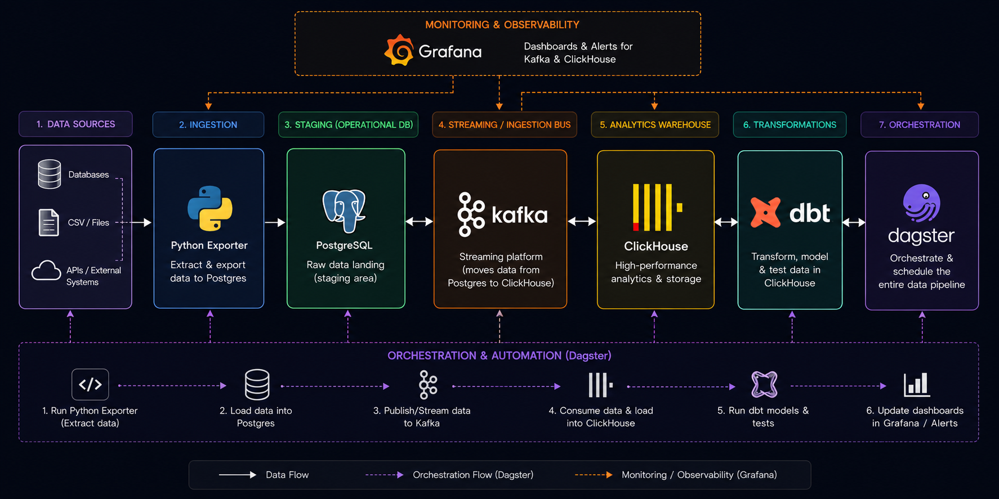

# Fintech StreamHouse ELT

A Docker-based data engineering project that loads fintech CSV datasets into **PostgreSQL**, streams data through **Kafka**, stores analytical data in **ClickHouse**, transforms it with **dbt**, orchestrates workflows with **Dagster**, and monitors Kafka/ClickHouse using **Prometheus** and **Grafana**.

---

## Architecture



The project follows this flow:

```text
CSV Files → Python Exporter → PostgreSQL → Kafka → ClickHouse → dbt
```

Monitoring and orchestration:

```text
Kafka / ClickHouse → Prometheus / Grafana
Dagster → Orchestration & automation
```

---

## Project Summary

This project simulates a fintech data platform where CSV files are ingested, streamed, transformed, orchestrated, and monitored inside a Docker Compose environment.

The main goal is to practice the full data engineering workflow:

- batch loading CSV files with Python
- storing raw data in PostgreSQL
- streaming data through Kafka
- loading analytical data into ClickHouse
- transforming data with dbt
- orchestrating assets and schedules with Dagster
- monitoring Kafka and ClickHouse with Prometheus and Grafana

---

## Tech Stack

| Tool | Purpose |
|---|---|
| **Python** | Reads fintech CSV files and loads them into PostgreSQL |
| **PostgreSQL** | Raw landing database for source data |
| **Kafka** | Streaming layer between PostgreSQL and ClickHouse |
| **Kafka Connect** | Runs connectors for moving data between systems |
| **ClickHouse** | Analytical warehouse for fast queries |
| **dbt** | Builds staging and fact models in ClickHouse |
| **Dagster** | Orchestrates pipeline tasks, assets, schedules, and lineage |
| **Prometheus** | Collects Kafka metrics |
| **Grafana** | Visualises Kafka and ClickHouse monitoring dashboards |
| **Kafka UI** | Used to inspect brokers, topics, consumers, and lag |
| **Docker Compose** | Runs the full local infrastructure |

---

## Docker Services

| Service | Purpose |
|---|---|
| `warehouse` | PostgreSQL database |
| `etl` | Python CSV exporter |
| `zookeeper` | Kafka coordination service |
| `kafka_broker` | Kafka broker |
| `kafka_connect` | Kafka Connect runtime |
| `kafkaui` | Kafka web UI |
| `clickhouse` | ClickHouse analytical database |
| `dbt` | dbt transformation container |
| `dagster` | Dagster orchestration UI |
| `kafka_exporter` | Kafka metrics exporter |
| `prometheus` | Metrics collection |
| `grafana` | Monitoring dashboards |

---

## Project Structure

```text
FINTECH/
│
├── clickhouse/
│   ├── init.sql
│   └── dbt/
│       ├── dockerfile.dbt
│       ├── profiles.yml
│       └── fintech_dbt/
│           ├── models/
│           │   ├── stg/
│           │   └── fcts/
│           ├── seeds/
│           ├── snapshots/
│           ├── tests/
│           ├── source.yml
│           └── dbt_project.yml
│
├── dagster_project/
│   ├── src/
│   ├── tests/
│   ├── dockerfile.dagster
│   └── pyproject.toml
│
├── exporter/
│   ├── datasets/
│   ├── dockerfile.export
│   ├── exporter.py
│   └── requirements.txt
│
├── kafka/
│   ├── connectors/
│   ├── plugins/
│   └── dockerfile.connect
│
├── postgres/
│   └── init.sql
│
├── prometheus/
│   └── prometheus.yml
│
├── .env
└── docker-compose.yml
```

---

## Dataset

The project uses four main CSV source groups:

| Data Source | Files | Purpose |
|---|---|---|
| **01. Transactions CSVs** | `orders.csv`, `order_items.csv`, `payments.csv`, `refunds.csv` | Transactional activity such as orders, payments, and refunds |
| **02. Customer CSVs** | `customers.csv` | Customer profile and signup data |
| **03. Merchant CSVs** | `merchants.csv`, `products.csv` | Merchant and product reference data |
| **04. Events CSVs** | `events.csv` | Customer behaviour and event activity |

---

## Final Outcome

The final platform shows a complete local data engineering setup where data is loaded, streamed, transformed, orchestrated, and monitored using modern open-source tools.
